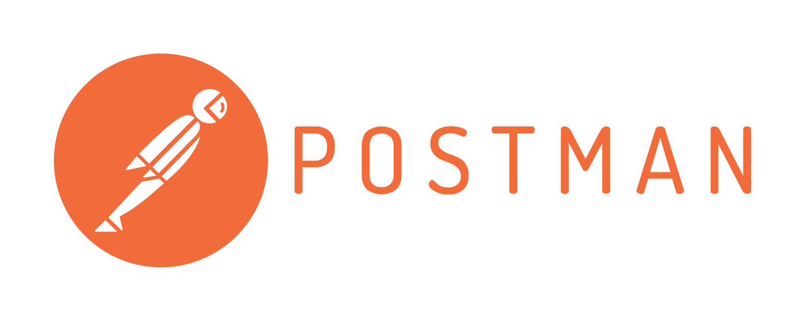
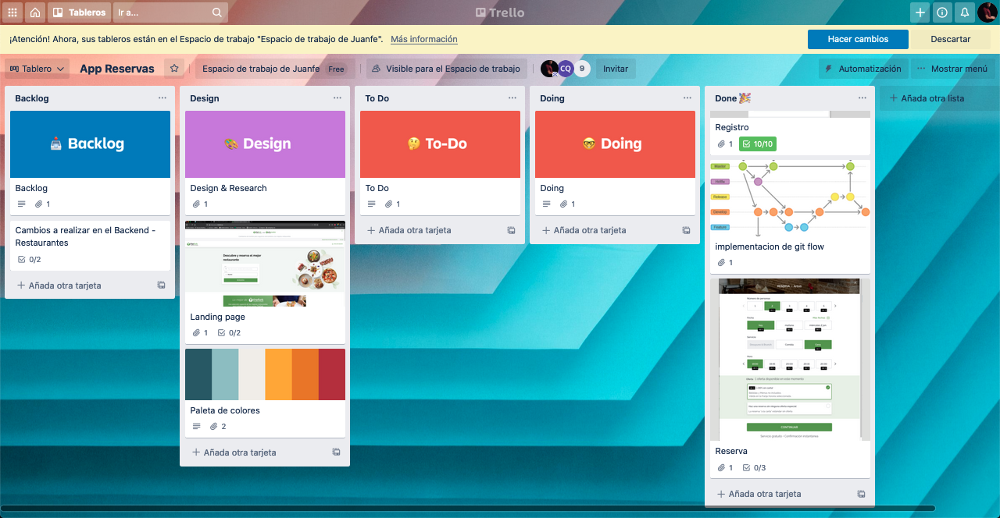
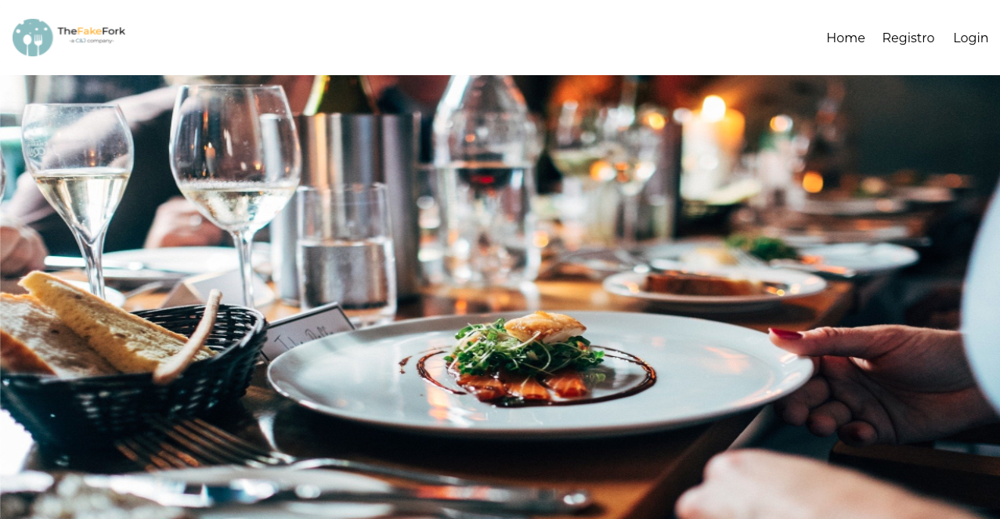
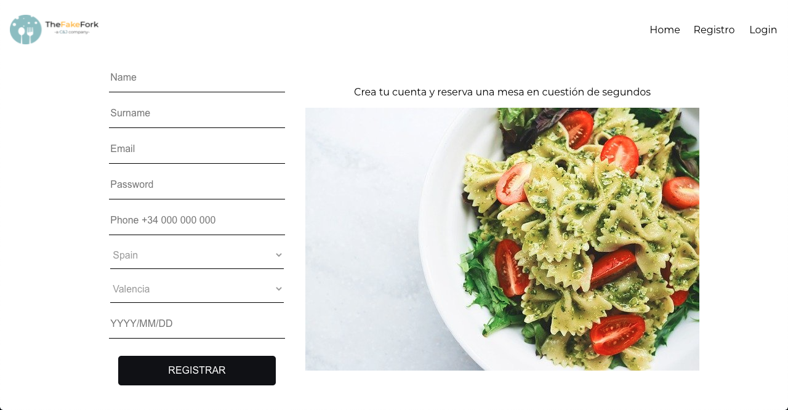
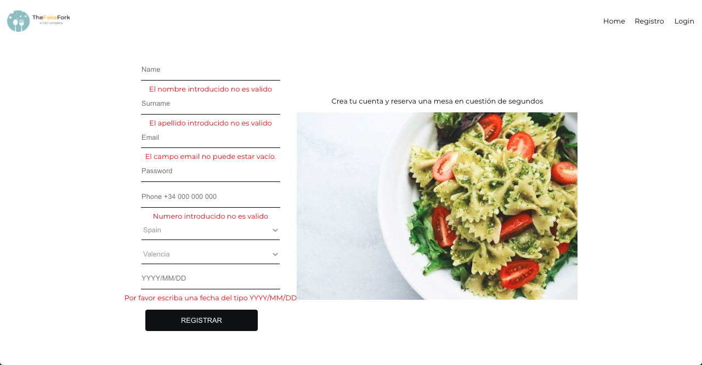
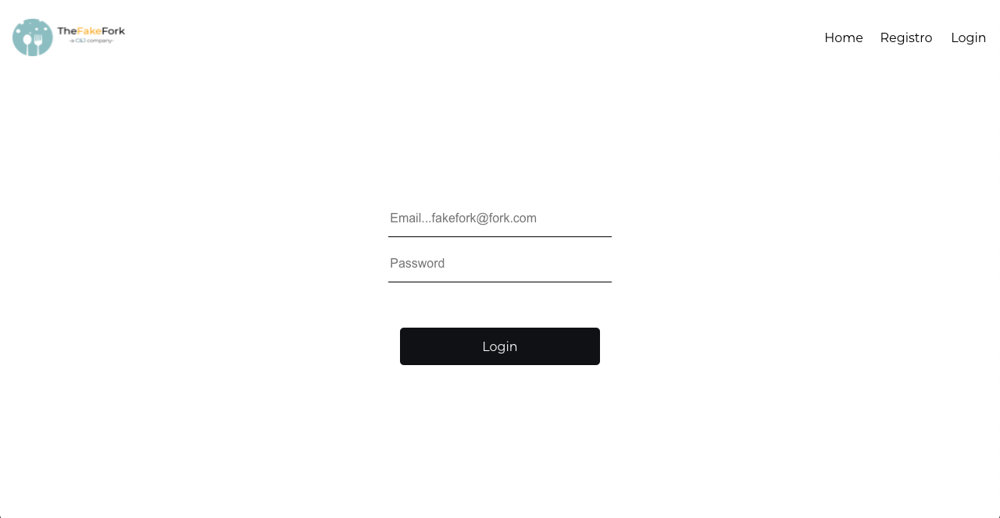
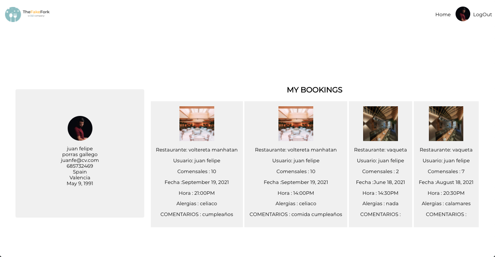

<a name="top"></a>

<h1>App Bookings Restaurants - Frontend</h1>


<b>The Fakefork</b>


</details>


🧐 [About](#id1)   

💻 [Technologys](#id2)

:clipboard: [Instructions](#id3)

⚙️ [Phase I backend development](#id4)
⚙️ [Phase II Frontend development](#id5)


---

<a name="id1"></a>
## **About**

This is the frontend for a restaurant reservation application.

This project is part of the Full Stack Developer Bootcamp taught by [GeeksHubs Academy](https://bootcamp.geekshubsacademy.com/).

---
**Phase II**
**Start Date:** 07/ jun /2021
**Deadline:** 21 / jun / 2021

**Collaborators:**
* [Carlos Quintero Moreno](https://github.com/CarlosRQuinteroM)
* [Juan Felipe Porras Gallego](https://github.com/juanfegallego)

---

<a name="id2"></a>

## **Technologies**

These are the technologies with which we have worked in this project:
         <details><summary>Click to expand trello picture</summary></details>


<a name="id3"></a>
***
## **Instructions**
<details>

<summary>Click to expand</summary>

<br>

- <b>To install all dependencies</b>
```
    $ npm i
```


</details>

<a name="id4"></a>
## [Phase I Backend development](https://github.com/CarlosRQuinteroM/proyecto_5_mongoose-GitFlow)
<a name="id5"></a>
## Phase II Frontedckend development
<!-- <details> -->


The project consists of the development of a reservation management system from the backend to the frontend.

We work with an internal database that is hosted in <b>MongoDB Atlas</b> and with its own API.

The frontend has these sections:

<b>Home</b>
<details>
<summary>Click to expand</summary>

</details>

</details>

<b>Register</b>
<details>
<summary>Click to expand</summary>



all boxes have error control applied



</details>

<b>Login</b>
<details>
<summary>Click to expand</summary>

</details>

<b>Profile + Bookings</b>
<details>
<summary>Click to expand</summary>

</details>

</details>


<a name="id5"></a>

<a name="id6"></a>


***
[:top:](#top)